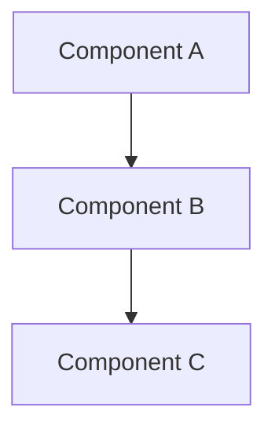

# Documentation Creator

Create up-to-date technical documentation by analyzing live codebase sections.

## Core Principles

1. **Always Fresh**: Generate docs from current code, never reference old documentation
2. **List Before Reading**: Show existing docs structure without reading them
3. **User-Specified Scope**: Never assume what to document - always ask
4. **Timestamped Output**: All docs saved as `docs/{section}/YYYYMMDD-{description}.md`

## Workflow

### Step 1: List Existing Documentation

Before starting, show the current docs structure:

```bash
# List existing documentation (customize path if different)
find docs -name "*.md" -type f 2>/dev/null | head -20

# Or use the bundled script if available
bash .claude/skills/doc-creator/scripts/list_docs.sh
```

This shows what's already documented (without reading files) to avoid duplication.

### Step 2: Interactive Scope Discovery

Ask the user what to document:

```
What part of the codebase should I document?

Examples:
- src/api/user.py (single file)
- src/components (directory)
- src/auth.py + src/middleware.py (multiple files)
- The authentication flow (concept/feature)
```

If user provides a concept/feature name (not a path), use Glob/Grep to discover relevant files.

### Step 3: Auto-Discover Files

Find all relevant files:

```bash
# For a directory
find src/components -type f -name "*.tsx" -o -name "*.ts"

# For a concept (search for keywords)
rg -l "authentication|auth|login" src/

# Use bundled discovery script if available
bash .claude/skills/doc-creator/scripts/discover_files.sh "{user_scope}"
```

Present the discovered files to the user for confirmation before proceeding.

### Step 4: Determine Documentation Type

Based on the scope, ask user what documentation format they need:

- **Mermaid Diagram**: Architecture, flowcharts, sequence diagrams, ER diagrams
- **API Documentation**: Endpoints, request/response schemas, error codes
- **Component Docs**: Props, usage examples, styling
- **Data Model Docs**: Database schemas, entity relationships, field types

Multiple formats can be combined in a single document.

### Step 5: Analyze Files

Read each discovered file completely (do not use offset/limit). Build comprehensive understanding:

- Function/class signatures and relationships
- Data flow and state management
- Dependencies and imports
- Key algorithms or business logic
- Error handling patterns

Take notes as you read - do not rely on memory across files.

### Step 6: Generate Documentation

Create the markdown file at `docs/{section}/YYYYMMDD-{description}.md`:

**Section**: The codebase path (e.g., `src/api` or `src/components`)

**Description**: Concise kebab-case summary (e.g., `user-api-overview` or `auth-flow-architecture`)

**Content structure**:

```markdown
# {Title}

**Generated**: {YYYY-MM-DD}
**Scope**: {List of files analyzed}

## Overview

[High-level summary of what this section does]

## {Diagrams/API Specs/Component Details}

[Core documentation content]

## File References

{file_path:line_number references for key functions/classes}

---
*Generated by doc-creator skill. Do not edit manually - regenerate for updates.*
```

### Step 7: Validate Output

Before finishing:

- Ensure file saved to correct path with correct naming
- Verify all code references include `file_path:line_number` format
- Confirm Mermaid syntax is valid (if applicable)
- Check that document is self-contained and up-to-date

## Output Requirements

### File Naming

```
docs/{codebase-section}/{YYYYMMDD}-{description}.md
```

Examples:
- `docs/src/api/20260112-user-api.md`
- `docs/src/components/20260112-dashboard-panel.md`
- `docs/src/20260112-auth-flow-architecture.md`

### Mermaid Diagram Format

```markdown
## Architecture Diagram


```

Use appropriate diagram types:
- `graph` for architecture/flow
- `sequenceDiagram` for request/response flows
- `erDiagram` for data models
- `classDiagram` for OOP structures

### Code References

Always use the format `file_path:line_number`:

```
The main handler is in src/api/user.py:45
```

## Anti-Patterns

**Don't**: Reference or read existing documentation files
**Do**: Analyze live source code to generate fresh docs

**Don't**: Assume what the user wants documented
**Do**: Ask explicitly and confirm file list before proceeding

**Don't**: Create generic "docs.md" files
**Do**: Use timestamped, descriptive filenames

**Don't**: Skip file discovery - manually guess at related files
**Do**: Use discovery scripts/commands to find all relevant files

## Example Invocations

**User**: "Create a Mermaid diagram of the API request flow"

**Response**:
1. List existing docs structure
2. Ask user to confirm scope: "src/api/ and related files?"
3. Run discovery, show results
4. Read all discovered files
5. Generate Mermaid sequence diagram showing request flow
6. Save to `docs/src/api/20260112-api-request-flow.md`

**User**: "Document the UserProfile component"

**Response**:
1. List existing docs structure
2. Ask: "Should I document src/components/UserProfile.tsx?"
3. Discover related files (hooks, types, styles)
4. Read all files
5. Generate component documentation with props, usage examples
6. Save to `docs/src/components/20260112-user-profile.md`

## Stack-Agnostic Notes

This skill works with any codebase:
- Adjust file discovery patterns for your language (`.py`, `.go`, `.rs`, `.ts`, etc.)
- Update the docs output path if your project uses a different convention
- Mermaid syntax is universal across all project types
