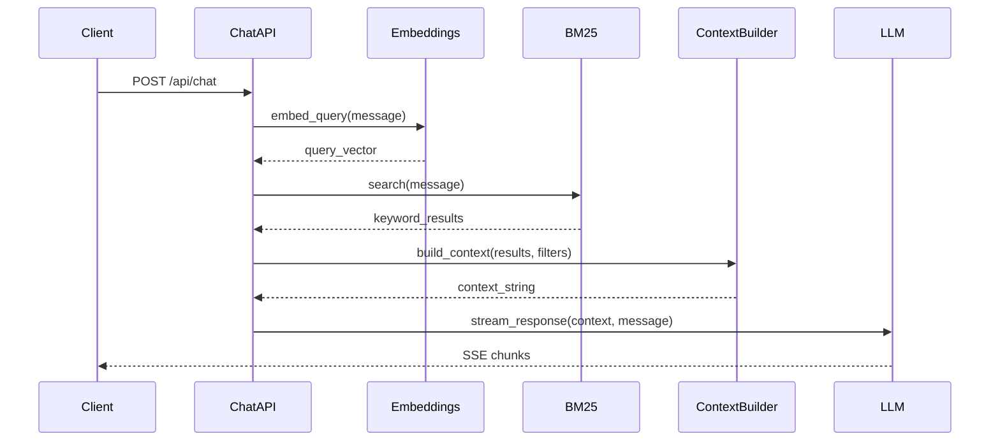
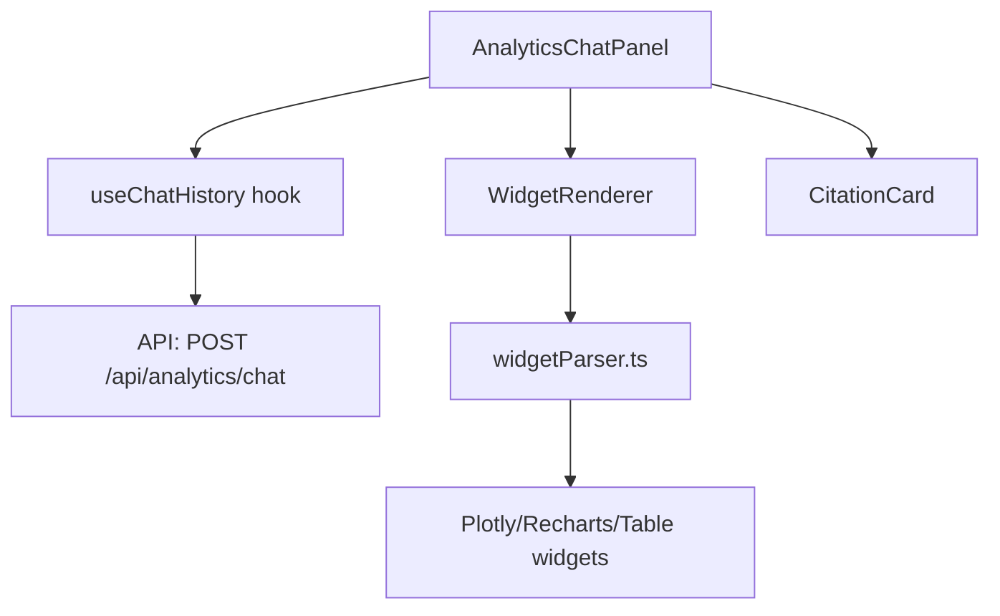
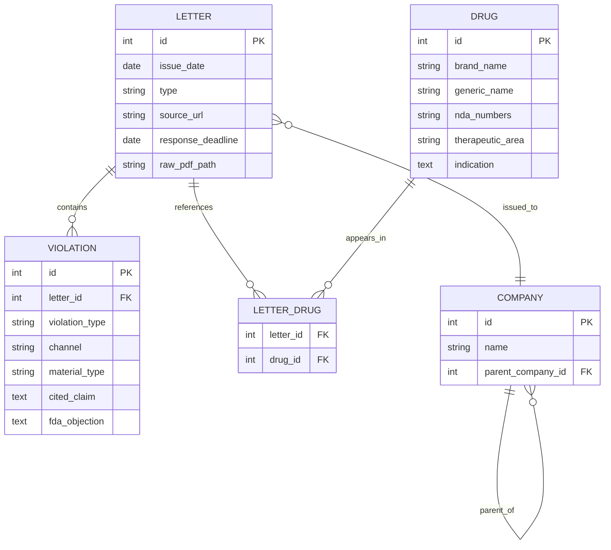

# Documentation Creator Examples

## Example 1: Backend API Documentation

**User Request**: "Document the chat API"

**Workflow**:

1. List existing docs:
```bash
bash ~/.claude/skills/doc-creator/scripts/list_docs.sh
```

Output:
```
Current documentation structure:
================================

docs/backend/20260110-database-schema.md
docs/frontend/20260111-component-library.md

================================
Total documentation files: 2
```

2. Discover files:
```bash
bash ~/.claude/skills/doc-creator/scripts/discover_files.sh "backend/app/chat.py"
```

Output:
```
/Users/kmaurinjones/Documents/All-Projects/repos/redline/backend/app/chat.py
/Users/kmaurinjones/Documents/All-Projects/repos/redline/backend/app/context_builder.py
/Users/kmaurinjones/Documents/All-Projects/repos/redline/backend/app/embeddings.py
```

3. Read all files completely
4. Generate documentation

**Output File**: `docs/backend/app/20260112-chat-api.md`

```markdown
# Chat API Documentation

**Generated**: 2026-01-12
**Scope**:
- backend/app/chat.py
- backend/app/context_builder.py
- backend/app/embeddings.py

## Overview

The chat API implements RAG-powered conversational search over FDA OPDP enforcement letters. It uses hybrid search (embeddings + BM25) to retrieve relevant documents, then constructs LLM context for response generation.

## API Endpoints

### POST /api/chat

Accepts user query and returns streaming chat response.

**Request**:
```json
{
  "message": "string",
  "conversation_id": "string | null",
  "filters": {
    "therapeutic_areas": ["string"],
    "violation_types": ["string"],
    "date_range": {"start": "YYYY-MM-DD", "end": "YYYY-MM-DD"}
  }
}
```

**Response**: Server-sent events stream
```
data: {"type": "chunk", "content": "Response text..."}
data: {"type": "citations", "citations": [...]}
data: {"type": "done"}
```

## Architecture Flow



## Key Functions

- **chat_handler** (backend/app/chat.py:67): Main request handler
- **hybrid_search** (backend/app/chat.py:145): Combines embedding + BM25 results
- **build_context** (backend/app/context_builder.py:23): Constructs LLM prompt

## Error Handling

| Error Code | Condition | Response |
|------------|-----------|----------|
| 400 | Missing message | `{"error": "message is required"}` |
| 500 | Embedding failure | `{"error": "failed to generate embeddings"}` |
| 503 | LLM unavailable | `{"error": "chat service temporarily unavailable"}` |

---
*Generated by doc-creator skill. Do not edit manually—regenerate for updates.*
```

---

## Example 2: Component Documentation

**User Request**: "Create documentation for the AnalyticsChatPanel component"

**Workflow**:

1. List existing docs
2. Discover files:
```bash
bash ~/.claude/skills/doc-creator/scripts/discover_files.sh "frontend/src/components/AnalyticsChatPanel.tsx"
```

Output:
```
/Users/kmaurinjones/Documents/All-Projects/repos/redline/frontend/src/components/AnalyticsChatPanel.tsx
/Users/kmaurinjones/Documents/All-Projects/repos/redline/frontend/src/hooks/useChatHistory.ts
/Users/kmaurinjones/Documents/All-Projects/repos/redline/frontend/src/lib/widgetParser.ts
```

3. Read all files completely
4. Generate component docs

**Output File**: `docs/frontend/components/20260112-analytics-chat-panel.md`

```markdown
# AnalyticsChatPanel Component

**Generated**: 2026-01-12
**Scope**:
- frontend/src/components/AnalyticsChatPanel.tsx
- frontend/src/hooks/useChatHistory.ts
- frontend/src/lib/widgetParser.ts

## Overview

A specialized chat interface for analytics queries. Supports natural language questions about data, executes Python code via backend, and renders visualizations inline.

## Component API

```typescript
interface AnalyticsChatPanelProps {
  initialMessage?: string;
  onVisualizationRender?: (widgetId: string) => void;
  className?: string;
}
```

## Usage Example

```tsx
import { AnalyticsChatPanel } from '@/components/AnalyticsChatPanel';

export default function AnalyticsPage() {
  return (
    <AnalyticsChatPanel
      initialMessage="Show me warning letters by therapeutic area"
      onVisualizationRender={(id) => console.log('Rendered:', id)}
    />
  );
}
```

## Component Structure



## Key Features

1. **Streaming responses**: Server-sent events from `/api/analytics/chat`
2. **Code execution**: Backend runs Python in sandboxed Jupyter kernel
3. **Widget parsing**: Detects `<widget type="...">` tags and renders visualizations
4. **Citation tracking**: Links visualizations to source data

## State Management

Uses `useChatHistory` hook (frontend/src/hooks/useChatHistory.ts:12):
- `messages`: Array of user/assistant messages
- `isLoading`: Request in progress
- `sendMessage`: Dispatch new user query

## Styling

Tailwind CSS classes following project conventions:
- `bg-white dark:bg-gray-900` for theme support
- `border-gray-200 dark:border-gray-700` for borders
- Responsive: `lg:grid-cols-2` for desktop split view

## Related Components

- **WidgetRenderer** (frontend/src/components/WidgetRenderer.tsx:45): Renders parsed widgets
- **CitationCard** (frontend/src/components/CitationCard.tsx:23): Displays letter citations

---
*Generated by doc-creator skill. Do not edit manually—regenerate for updates.*
```

---

## Example 3: Data Model Documentation

**User Request**: "Document the database schema for letters"

**Workflow**:

1. List existing docs
2. Discover files:
```bash
bash ~/.claude/skills/doc-creator/scripts/discover_files.sh "backend/app/db_schema.py"
```

3. Read schema file
4. Generate ER diagram

**Output File**: `docs/backend/20260112-database-schema.md`

```markdown
# Database Schema: Letters

**Generated**: 2026-01-12
**Scope**: backend/app/db_schema.py

## Overview

SQLite database schema for FDA OPDP enforcement letters, violations, drugs, and companies.

## Entity Relationship Diagram



## Table Definitions

### LETTER

| Column | Type | Constraints | Description |
|--------|------|-------------|-------------|
| id | INTEGER | PRIMARY KEY | Auto-increment ID |
| issue_date | DATE | NOT NULL | Date FDA issued letter |
| type | VARCHAR(20) | NOT NULL | 'warning' or 'untitled' |
| source_url | VARCHAR(512) | NOT NULL, UNIQUE | FDA letter URL |
| response_deadline | DATE | NULLABLE | Deadline for company response |
| raw_pdf_path | VARCHAR(256) | NULLABLE | Local path to PDF |

### VIOLATION

| Column | Type | Constraints | Description |
|--------|------|-------------|-------------|
| id | INTEGER | PRIMARY KEY | Auto-increment ID |
| letter_id | INTEGER | NOT NULL, FK | References LETTER.id |
| violation_type | VARCHAR(100) | NOT NULL | From controlled taxonomy |
| channel | VARCHAR(50) | NULLABLE | Distribution channel |
| material_type | VARCHAR(50) | NULLABLE | Type of promotional material |
| cited_claim | TEXT | NULLABLE | Specific claim FDA cited |
| fda_objection | TEXT | NULLABLE | FDA's objection text |

**Violation Type Taxonomy**:
- `omission_of_risk`
- `inadequate_fair_balance`
- `misleading_efficacy`
- `misleading_presentation`
- `broadening_indication`
- `unsubstantiated_superiority`
- `inadequate_risk_communication`
- `misleading_headlines`

### DRUG

| Column | Type | Constraints | Description |
|--------|------|-------------|-------------|
| id | INTEGER | PRIMARY KEY | Auto-increment ID |
| brand_name | VARCHAR(100) | NOT NULL | Brand name of drug |
| generic_name | VARCHAR(100) | NULLABLE | Generic/chemical name |
| nda_numbers | VARCHAR(200) | NULLABLE | Comma-separated NDA/BLA numbers |
| therapeutic_area | VARCHAR(100) | NULLABLE | Therapeutic classification |
| indication | TEXT | NULLABLE | Approved indication |

### COMPANY

| Column | Type | Constraints | Description |
|--------|------|-------------|-------------|
| id | INTEGER | PRIMARY KEY | Auto-increment ID |
| name | VARCHAR(200) | NOT NULL, UNIQUE | Company name |
| parent_company_id | INTEGER | NULLABLE, FK | Self-referential for subsidiaries |

---
*Generated by doc-creator skill. Do not edit manually—regenerate for updates.*
```

---

## Notes

- All examples show complete file discovery → read → generate workflow
- Timestamped filenames prevent accidental overwrites
- Mermaid diagrams tailored to content type (sequence, graph, ER)
- File references use `path:line` format throughout
- Footer disclaimer ensures docs aren't manually edited
