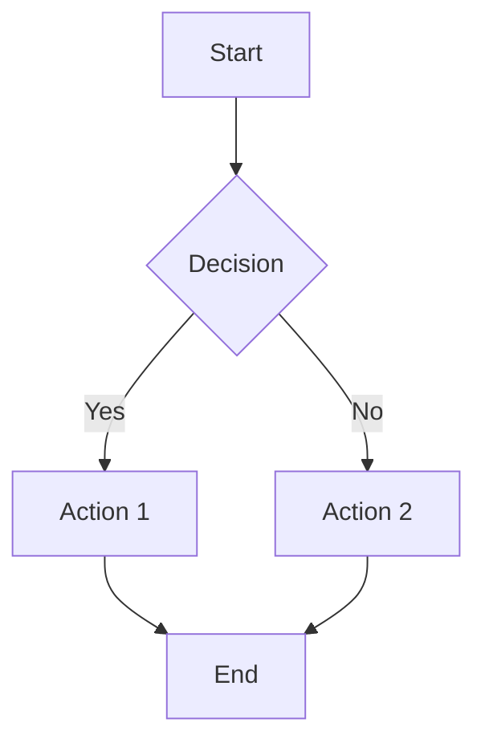
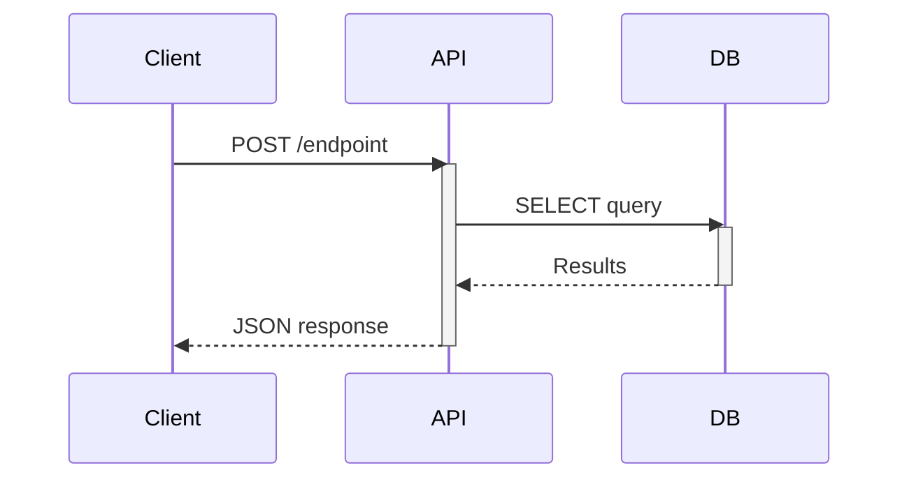
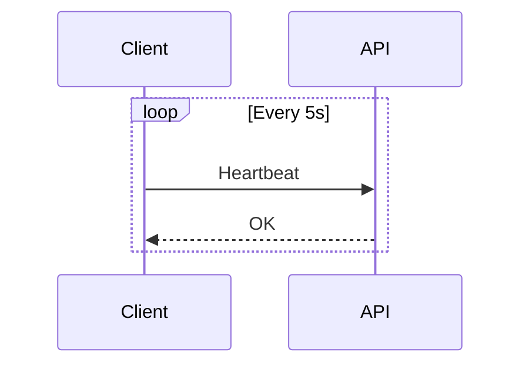
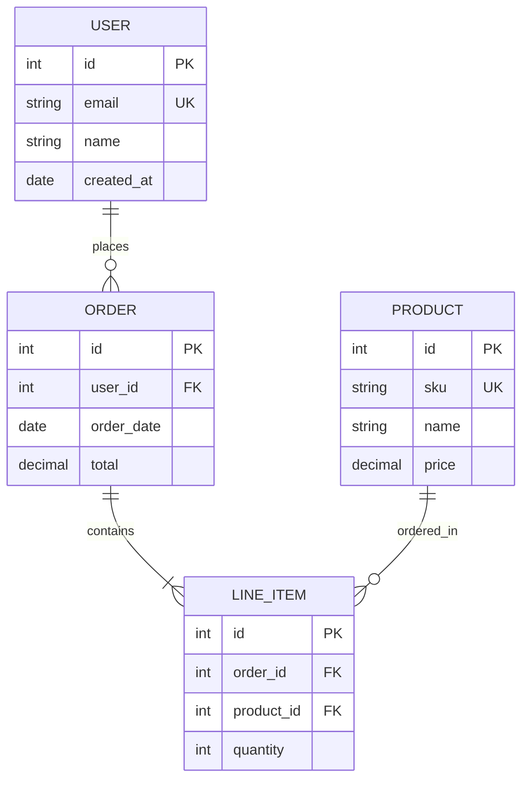
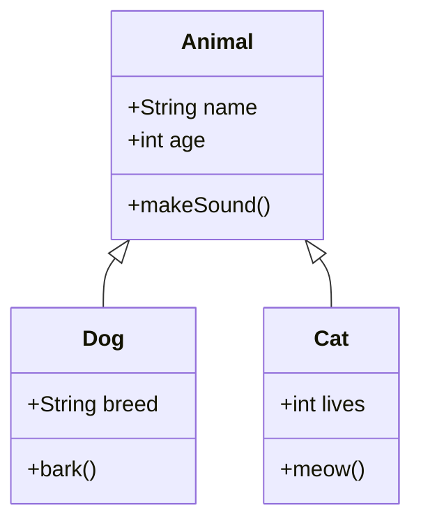
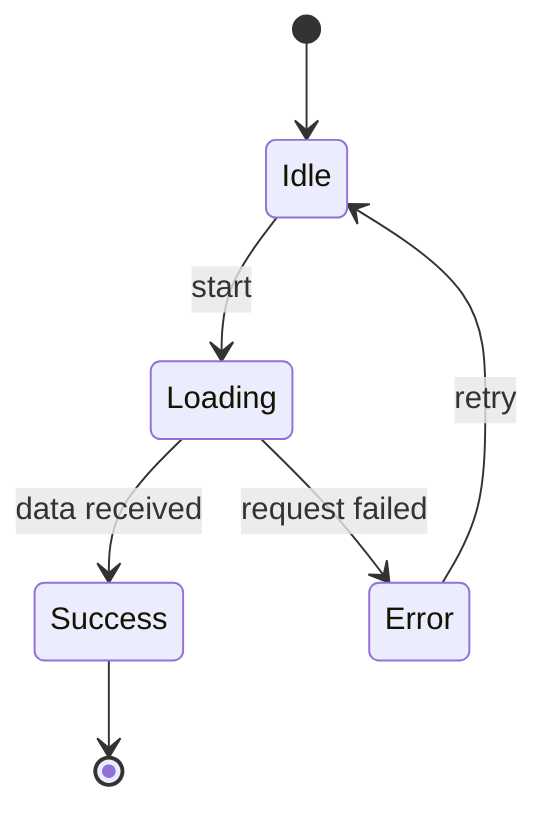
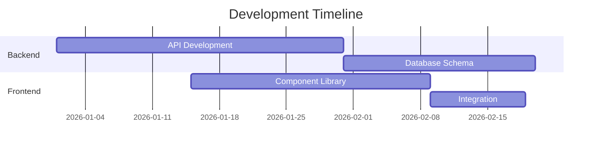
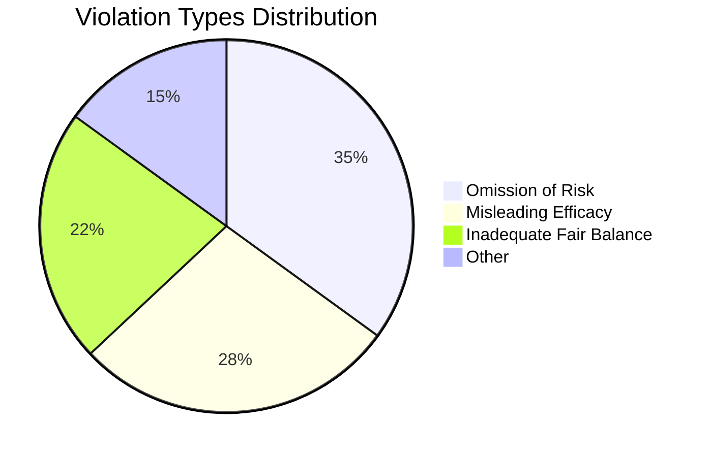

# Mermaid Diagram Syntax Reference

Quick reference for generating valid Mermaid diagrams in documentation.

## Graph (Flowchart)

**Use for**: Architecture diagrams, process flows, component relationships

**Direction**:
- `TD` or `TB`: Top to bottom
- `BT`: Bottom to top
- `LR`: Left to right
- `RL`: Right to left

**Node Shapes**:
- `[Square]`: Rectangle
- `(Round)`: Rounded edges
- `{Diamond}`: Decision
- `((Circle))`: Circle
- `>Flag]`: Asymmetric shape
- `[(Database)]`: Cylinder

**Connections**:
- `-->`: Arrow
- `---`: Line
- `-.->`: Dotted arrow
- `==>`: Thick arrow
- `--text-->`: Labeled arrow

---

## Sequence Diagram

**Use for**: API request/response flows, async operations, inter-service communication

**Syntax**:
- `participant Name`: Declare participant
- `A->>B`: Solid arrow (request)
- `A-->>B`: Dashed arrow (response)
- `activate/deactivate`: Show lifecycle
- `Note right of A: Text`: Add annotations

**Loops**:

---

## Entity Relationship Diagram

**Use for**: Database schemas, data models

**Relationships**:
- `||--||`: One to one
- `||--o{`: One to many
- `}o--o{`: Many to many
- `||--|{`: One to one or more

**Cardinality symbols**:
- `||`: Exactly one
- `o|`: Zero or one
- `}o`: Zero or more
- `}|`: One or more

**Field annotations**:
- `PK`: Primary key
- `FK`: Foreign key
- `UK`: Unique key

---

## Class Diagram

**Use for**: OOP structures, component hierarchies

**Relationships**:
- `<|--`: Inheritance
- `*--`: Composition
- `o--`: Aggregation
- `-->`: Association
- `..>`: Dependency

**Visibility**:
- `+`: Public
- `-`: Private
- `#`: Protected
- `~`: Package

---

## State Diagram

**Use for**: UI state machines, workflow states

---

## Gantt Chart

**Use for**: Project timelines (rare in code docs)

---

## Pie Chart

**Use for**: Data distributions (rare in architecture docs)

---

## Tips for Code Documentation

1. **Choose the right diagram type**:
   - Architecture → Graph
   - API flows → Sequence
   - Database → ER Diagram
   - OOP → Class Diagram

2. **Keep it simple**: Limit to 10-15 nodes per diagram

3. **Use consistent naming**: Match code identifiers where possible

4. **Label relationships**: Add text to arrows for clarity

5. **Test syntax**: Mermaid errors break rendering—validate before saving

6. **Add context**: Include a text explanation before/after the diagram

---

## Validation

Before saving documentation, ensure:
- No syntax errors (balanced braces, proper keywords)
- All node IDs referenced in connections are declared
- Direction/layout makes sense for the content
- Diagram renders without errors in Mermaid Live Editor
