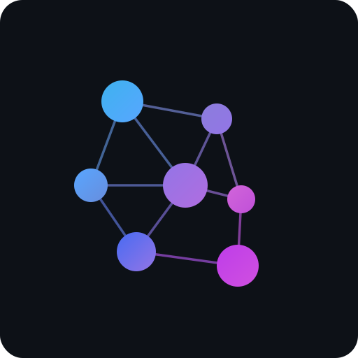

<p align="center">
  
</p>

<h1 align="center">ontograph</h1>

<p align="center">
  <strong>LLM-powered knowledge graph engine</strong><br>
  Ontological entity resolution &middot; Orbit-based proximity scoring &middot; Hybrid semantic-graph retrieval
</p>

<p align="center">
  <a href="https://pypi.org/project/ontograph/"></a>
  <a href="https://pypi.org/project/ontograph/"></a>
  <a href="https://github.com/kmaurinjones/ontograph/blob/main/LICENSE"></a>
</p>

---

## Install

```bash
pip install ontograph
```

Requires `OPENAI_API_KEY` environment variable (or set it in a `.env` file — loaded automatically).

## Quick Start

```python
from ontograph import OntoDB, Schema

db = OntoDB("my_knowledge.db")

# Define an ontology schema (constrains what the LLM extracts)
db.register_schema(Schema(
    name="workplace",
    entity_types=["person", "project", "team", "meeting", "topic"],
    relationship_types=[
        {"name": "works_on", "directed": True},
        {"name": "manages", "directed": True},
        {"name": "colleague", "directed": False},
        {"name": "discussed", "directed": True},
    ],
))

# Ingest unstructured text — entities and relationships extracted automatically
db.ingest(
    "Meeting with Nara and Marco about Project Neptune. "
    "Nara is leading the backend rewrite. Marco raised concerns about the launch deadline.",
    source_type="transcript",
    schema_name="workplace",
)

# Search the graph (semantic + keyword + graph traversal)
results = db.search("What is Nara working on?")

# Ask a question — LLM synthesizes answer from graph context
answer = db.ask("Who is concerned about the launch deadline?")
print(answer)
```

## Core Concepts

### Entities, Relationships, Attributes

Everything decomposes into three primitives:

| Primitive | Description |
|---|---|
| **Entities** | Nodes — people, projects, topics, anything nameable |
| **Relationships** | Edges — directed (`A → B`) or bidirectional (`A ↔ B`) |
| **Attributes** | Key-value metadata on entities and relationships |

### Entity Resolution

When ingesting text, names are fuzzy-matched against existing entities using a four-signal composite score:

| Signal | Method | Catches |
|---|---|---|
| Phonetic | Metaphone | Pronunciation-similar names |
| Spelling | Jaro-Winkler | Typos and minor variations |
| Semantic | Embedding cosine | Conceptual matches |
| Orbit | Interaction frequency | Context-aware disambiguation |

### Orbit

Your "orbit" is a proximity model. Entities you interact with frequently score higher — when "Sal" appears in a transcript, the system weights your manager "Sam" (who you interact with daily) over random "Sal"s elsewhere.

```python
sam = db.get_entity("Sam")
db.add_alias(sam.id, "Sal", alias_type="transcript_error")
```

### File References

Entities can reference external files — receipts, photos, PDFs, contracts — that live on disk. These references are surfaced during search and Q&A so the LLM knows where to find supporting material.

```python
# Attach files to an entity
db.attach_files("kitchen renovation", [
    "/Users/me/photos/kitchen_before.jpg",
    "/Users/me/photos/kitchen_after.jpg",
])

# When you ask a question, the LLM sees the file references
answer = db.ask("What photos do we have of the kitchen?")
```

```bash
# Or via CLI
ontograph attach "kitchen renovation" /Users/me/photos/kitchen_before.jpg
```

### Schemas

Ontology schemas define valid entity and relationship types for a domain. They constrain what the LLM can extract during ingestion.

### Self-Improving Feedback Loop

Every entity resolution is logged. Mark resolutions as correct/incorrect to track accuracy over time:

```python
db.mark_resolution("log_id", correct=True)
print(db.stats()["resolution_accuracy"])
```

## Python API

| Method | Description |
|---|---|
| `OntoDB(db_path, api_key, observer_id)` | Main entry point |
| `.ingest(text, source_type, schema_name)` | Ingest unstructured text |
| `.search(query, limit, graph_depth)` | Hybrid search |
| `.ask(question)` | LLM-synthesized answer from graph context |
| `.add_entity(name, type, attributes, file_refs)` | Manual entity creation |
| `.add_relationship(source, target, type)` | Manual relationship creation |
| `.attach_files(entity, file_paths)` | Attach file references |
| `.detach_files(entity, file_paths)` | Remove file references |
| `.resolve(name, entity_type, observer)` | Entity resolution |
| `.orbit(observer, limit)` | Proximity-ranked entities |
| `.stats()` | Graph statistics and resolution accuracy |

## CLI

```bash
ontograph --help                    # Full command list with examples
ontograph ingest --text "..."       # Ingest text (also accepts --file or stdin)
ontograph search "query"            # Hybrid search
ontograph ask "question"            # LLM-synthesized answer
ontograph entities [--type person]  # List entities
ontograph entity "name"             # Get single entity
ontograph relationships "name"      # Get relationships
ontograph neighbors "name"          # Graph traversal
ontograph resolve "name"            # Entity resolution
ontograph attach "entity" file.pdf  # Attach file references
ontograph detach "entity" file.pdf  # Remove file references
ontograph schema register --file s.json  # Register ontology schema
ontograph dashboard                 # Interactive graph visualization
```

## Dashboard

```bash
ontograph dashboard                 # Opens browser at http://127.0.0.1:8484
ontograph dashboard --port 9000    # Custom port
ontograph --db project.db dashboard
```

Interactive force-directed graph visualization powered by D3.js. Starts with the most-connected entity as hub, showing its top 50 relationships. Click to select, double-click to expand connections on demand, drag to reposition, scroll to zoom.

## License

MIT
